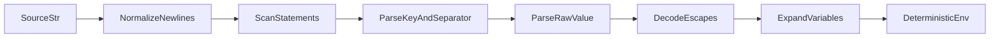
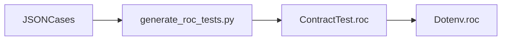

# rocdotenv Design

## Goal

`rocdotenv` should be a Roc package that matches the core behavior of
`joho/godotenv` while presenting an idiomatic, pure Roc API.

The typed semantic model lives in `semantics/`. The first implementation target
is the generated contract suite in `ContractTest.roc`, which is generated from
JSON cases in `test/cases/`.

## Compatibility Target

The package should match `godotenv` for:

- Key/value parsing.
- `export` prefixes.
- YAML-ish `KEY: value` syntax.
- Empty values and empty keys.
- Comments and ignored lines.
- Single-quoted, double-quoted, unquoted, and multiline values.
- Escape handling.
- Variable expansion from previously parsed values and explicit existing env.
- Marshal output, including sorting, integer detection, and escaping.
- Roundtrip behavior over upstream fixtures.

File-system and process-environment behavior is modeled with explicit fake
inputs in `test/cases/io.json`. `cli.roc` is the first real side-effecting
adapter, and remaining gaps are tracked in `test/cases/deferred-io.md`.

## Semantic Model

The semantics are split by behavior area:

- `semantics/model.allium`: domain values, entities, variants, and errors.
- `semantics/functions.allium`: semantic operations and typed contracts.
- `semantics/parsing.allium`: source parsing into deterministic entries.
- `semantics/expansion.allium`: variable expansion and lookup order.
- `semantics/marshal.allium`: deterministic serialization.
- `semantics/load.allium`: pure fake file-system and environment application.

The JSON files under `test/cases/` are executable examples of these semantics.
The Roc implementation should remain a replaceable realization of the semantic
model rather than the source of truth for the model.

## Public Package Shape

`main.roc` exposes the `Dotenv` module:

```roc
package [Dotenv] {}
```

The reusable core should stay pure. File loading, process environment reads,
stdout/stderr writes, subprocess execution, and any environment mutation should
live in adapters or apps.

Current public surface:

```roc
Entry : { key : Str, value : Str }
Env : List Entry
FakeFileSource : [File Str, Directory]
FakeFile : { path : Str, source : FakeFileSource }
ParseErr : [UnexpectedChar, UnterminatedQuote]
MarshalErr : [MarshalFailed]
ReadErr : [FileNotFound Str, IsDirectory Str, UnexpectedChar, UnterminatedQuote]

parseString : Str, Env -> Result Env ParseErr

marshalEnv : Env -> Result Str MarshalErr

mergeParsedFiles : List Env -> Env

applyParsedEnv : Env, Env, [PreserveExisting, OverrideExisting] -> Env

readFiles : List Str, List FakeFile, Env -> Result Env ReadErr

loadEnv : List Str, List FakeFile, Env -> Result Env ReadErr

overloadEnv : List Str, List FakeFile, Env -> Result Env ReadErr
```

The named aliases keep the API explicit in generated docs while preserving the
plain record/list representation that makes tests and interop straightforward.

## Implementation Layout

`Dotenv.roc` is the public facade. The implementation is split to match the
semantic model:

- `Types.roc`: shared aliases for entries, environments, fake files, and errors.
- `CliAdapter.roc`: pure CLI argument/config handling and conversion into the
  existing fake-file/environment model.
- `EnvOps.roc`: lookup, replace-by-key insertion, merging, and load policy application.
- `Expansion.roc`: variable expansion and expansion-name lookup.
- `Parser.roc`: statement scanning and source parsing.
- `Marshaller.roc`: deterministic dotenv serialization.
- `PureFileLoading.roc`: pure fake file-system read/load/overload behavior.
- `cli.roc`: effectful CLI app that reads args, files, and process env, then
  delegates behavior to the pure modules.

## Data Model

Use a deterministic environment representation:

```roc
Env : List Entry
```

This keeps equality checks stable and avoids committing too early to a `Dict`
representation. Internally, helper functions handle lookup, insert, override,
dedupe, and sorting.

Important compatibility note: `godotenv` key parsing allows
`[A-Za-z0-9_.-]`, but variable expansion only recognizes names matching
`[A-Z0-9_]+`.

## Parser Architecture

Use a hand-written scanner/state machine, not a regex parser and not
line-level parallel parsing.

Recommended flow:



### Scanner States

- `SeekingStatement`: skip whitespace, blank lines, and full-line comments.
- `ReadingKey`: collect and validate the key until `=` or `:`.
- `BeforeValue`: trim separator-adjacent whitespace.
- `UnquotedValue`: read to statement end, strip inline comments and trailing whitespace.
- `SingleQuotedValue`: read until an unescaped `'`; preserve literal content.
- `DoubleQuotedValue`: read until an unescaped `"`; allow multiline content.
- `DoneStatement`: append the parsed value and continue.

### Why Statement Scanning

Do not split the input by lines first. Multiline quoted values mean line
boundaries are not always statement boundaries.

## Variable Expansion

Expansion should be sequential and deterministic.

Lookup order:

1. Values parsed earlier in the same source.
2. Explicit `existingEnv` input.
3. Empty string if unresolved.

No process environment reads should happen inside `parseString`.

Expansion applies to:

- Unquoted values.
- Double-quoted values.

Expansion does not apply to:

- Single-quoted values.
- Escaped `$FOO`.
- Escaped `${FOO}`.

## Marshal Architecture

Marshal should:

- Sort output by key.
- Emit integers without quotes.
- Quote non-integers with double quotes.
- Escape double quotes, backslashes, newlines, carriage returns, `!`, `$`, and backticks like `godotenv`.
- Preserve leading-zero integer strings as unquoted, matching upstream.
- Quote leading-plus values because `+123` is not considered an integer by `godotenv`.

## Performance Notes

Existing parsers suggest a simple scanner is enough:

- `godotenv` uses byte-slice scanning plus compiled regexes for escapes and expansion.
- Node `dotenv` has a newer `parseFast` hand-written scanner for its fast path.
- Ruby `dotenv` is regex-driven, but that is less attractive for Roc.
- Formal dotenv-spec material describes tokenization as a state machine.

Parallel parsing is not a good initial fit because:

- Multiline quoted values cross line boundaries.
- Variable expansion depends on earlier assignments.
- Comments depend on quote state.
- Load/apply semantics depend on ordering.
- `.env` files are typically small.

Optimize scanner allocations before considering concurrency.

## Error Design

Current contract cases need:

- `UnexpectedChar`
- `UnterminatedQuote`
- `MarshalFailed`
- `FileNotFound Str`
- `IsDirectory Str`

Potential improvement:

- Keep public compatibility tags stable.
- Internally track line, column, and character for better future diagnostics.
- Avoid host-specific error strings in the pure core.

## Pure Load Semantics

`mergeParsedFiles` and `applyParsedEnv` should model the pure parts of
`Read`, `Load`, and `Overload`.

Duplicate keys are explicit in the list representation:

- `mergeParsedFiles` dedupes by key while preserving first-seen order where
  possible.
- Later files overwrite earlier values, matching `godotenv.Read`.
- `loadEnv` preserves existing process-env values, while `overloadEnv`
  replaces them.

## I/O Model

The reusable package models file and environment behavior with explicit inputs.
It does not read files or mutate the process environment.

Purely modeled behaviors:

- Default `.env` path.
- Missing-file errors.
- Directory-read errors.
- Process env preserve/override.
- Process env fallback during variable expansion.

Adapter path:

1. Keep fake file-system and fake-env JSON cases as the contract.
2. Keep platform and CLI adapters thin wrappers over the pure package functions.
3. Add host-specific behavior only at the app/platform edge.

`cli.roc` is the first side-effecting adapter. It uses the selected CLI platform
to read command-line arguments, read files, read the current process
environment, and write stdout/stderr. It cannot mutate the parent shell
environment; no standalone child process can. Future command-exec behavior could
apply dotenv values to a subprocess environment instead.

## Test Strategy

The JSON files under `test/cases/` are the durable compatibility spec.

Generation flow:



Commands:

```sh
uv run python scripts/generate_roc_tests.py
roc format main.roc Dotenv.roc ContractTest.roc
roc check main.roc
roc docs main.roc --output /tmp/rocdotenv-docs
roc test ContractTest.roc
```

Current package quality gates:

- Package check passes.
- Docs generation passes.
- Generated pure contract tests pass.

Ongoing implementation workflow:

- Make one parser or marshaller slice green at a time.
- Regenerate tests when JSON cases change.
- Keep platform and CLI adapter work separate from the pure package contract.
